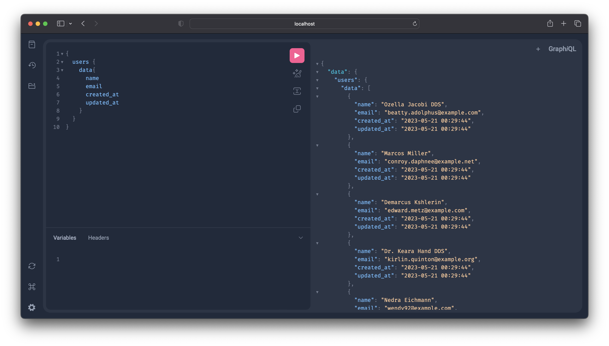

# Laravel GraphQL API with MySQL


## 🧩 Features

- Laravel 12 with GraphQL integration
- Query and mutate data using GraphQL endpoints
- MySQL database support
- Example schema for CRUD operations
- GraphiQL interface for testing

---

## 🖼️ Project Preview



*(Add your screenshot to `docs/images/graphql-laravel-preview.png`)*

---

## 🛠️ Tech Stack

- **Backend:** Laravel (PHP 8+)
- **Database:** MySQL
- **API Type:** GraphQL (via `rebing/graphql-laravel` package)

---

## 🚀 Getting Started

### 1️⃣ Clone the Repository

```bash
git clone https://github.com/Sandalanka/laravel-grapql-api.git
cd laravel-graphql-api
